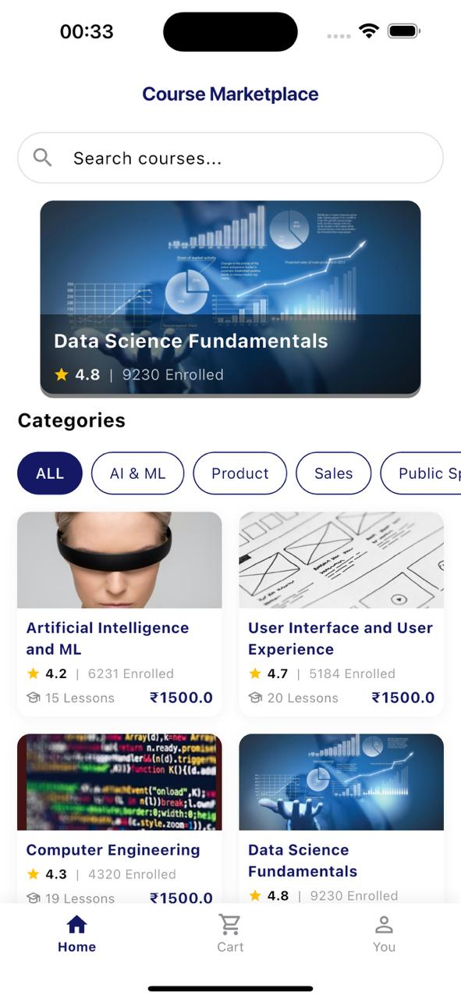

# Catalift - A Course Management App in Flutter

A simple Flutter app for browsing, bookmarking, and managing courses in a cart, built as part of Catalift's Developer Task to assess development skills, code structure, and UI implementation capabilities.

## Demo

*Click the image to watch the demo video on Google Drive.*

## Functionality:
- Browse featured and similar courses categorized by topics (e.g., AI & ML, Design, Public Speaking).
- Add courses to a cart for potential enrollment.
- Bookmark courses to save them for later.
- Persist cart and bookmark state across app restarts using `shared_preferences`.
- View course details (title, description, price, rating, enrollments, lessons).
- Filter courses by category.
- Smooth animations integrated throughout the app for enhanced user experience.

## Non-Functional Requirements:
- Proper folder structure (data, models, providers, screens, utils, widgets).
- State management using the `provider` package.
- Persistence of user data (cart and bookmarks) using `shared_preferences`.
- Clean and maintainable code following Flutter best practices.

## Project Structure:
- **data/**: Contains hardcoded course data.
- **models/**: Defines the `Course` model.
- **providers/**: Manages state for cart and bookmarks.
- **screens/**: UI screens for the app.
- **utils/**: Utility files for navigation and theme.
- **widgets/**: Reusable UI components.
